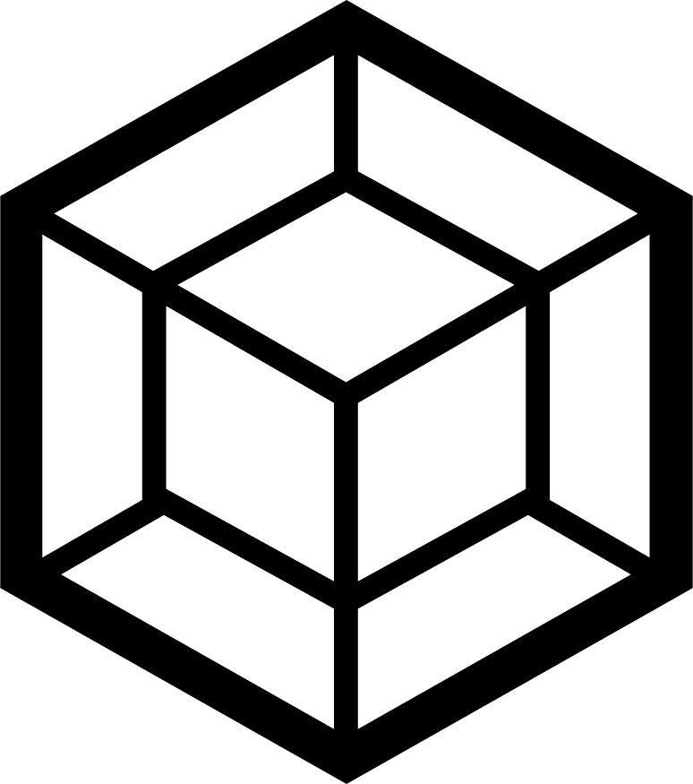

# "Aloha Apparel Co." Home Page

#### Author: Jarid Warren [ <jaridwarren@gmail.com> ]

Home page for an apparel company, complete with swipable product carousel, fixed header, functional "Add to cart" buttons and a responsive design.

### Desktop & Mobile View Demo


## Motivation

Learning CSS3 flexbox, jQuery, smooth scrolling with JavaScript, and @font-face.

## Technology

-  JavaScript ES6 /  jQuery
-  NPM /  Webpack /  Babel
-  Sass /  CSS3
-  HTML5

## Code Sample

The following adds a shadow to the header once the user has scrolled from the top of the page.

```javascript
$(function() {
  $(window).scroll(function() {
    if ($(window).scrollTop() === 0) {
      $('header').css({ 'box-shadow': 'none' });
    } else {
      $('header').css({ 'box-shadow': '1.5px 3.5px 4px 0 #CCCCCCCC' });
    }
  });
});
```

## Setup

Download or clone repo, then run the following commands in terminal:

**Initialize NPM:**

`> npm init`

**Install Webpack:**

`> npm install`

**Build project:**

`> webpack`

**Build project for production (compression):**

`> webpack -p`

**Launch dev server to automatically update changes:**

`> webpack-dev-server`

## @TODO

- [compress images used in](https://medium.com/a-beginners-guide-for-webpack-2/handling-images-e1a2a2c28f8d) `index.html`(currently only `style.css` images are compressed)
- change main layout to use CSS grid (columns for sections)
